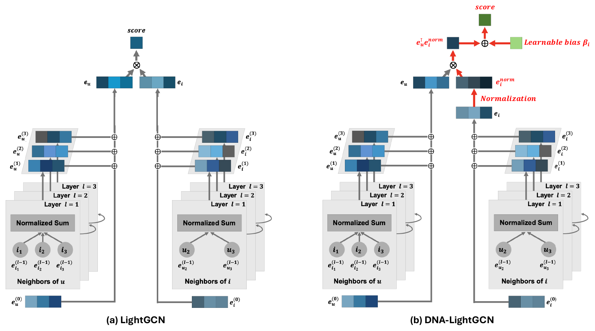

<div align="center">

# GCNs Meet Long-Tail: Embedding Norm Bias in GCN-Based Recommendations

**Yeo-Jun Choi** &nbsp;·&nbsp; **[Woo-Seong Yun](https://scholar.google.com/citations?user=ZRXyvtMAAAAJ)** &nbsp;·&nbsp; **Chan-Woo Jeong** &nbsp;·&nbsp; **Yoon-Sik Cho**

<sub>Department of Artificial Intelligence, Chung-Ang University</sub>

*Applied Soft Computing, vol. 186, 114226, 2026*

[](https://doi.org/10.1016/j.asoc.2025.114226)
[](https://www.python.org/)
[](https://pytorch.org/)

</div>

This is the PyTorch implementation for our DNA paper:

> GCNs Meet Long-Tail: Embedding Norm Bias in GCN-Based Recommendations (Applied Soft Computing, 2026)

This repository is a fork of the official implementation at [Chanwoo-Jeong-2000/DNA](https://github.com/Chanwoo-Jeong-2000/DNA).

<p align="center">
  
</p>

## Overview

GCN-based recommenders capture high-order user–item relations, but on long-tail data their message passing amplifies popularity bias: high-degree items accumulate larger gradients and inflated embedding norms, so they dominate recommendations regardless of relevance. Cosine-similarity remedies discard user embedding norms along with the bias, and contrastive remedies add costly augmentation without addressing norm disparity directly. To address these limitations, we propose **DNA** (Debiasing with Norm Adjustment). DNA normalizes only item embeddings, preserving user magnitudes, and adds a learnable item-specific bias trained outside the GCN so it restores popularity signals without re-learning the amplified bias. DNA plugs into any GCN backbone without architectural changes, consistently improves five backbones on three benchmarks, and raises the recommendation ratio of low-degree items by up to 5×.

## Requirements

Python 3.8 and CUDA 11.8 were used in our experiments.

```bash
pip install torch==2.0.0 torchvision==0.15.1 torchaudio==2.0.1 --index-url https://download.pytorch.org/whl/cu118
pip install torch-scatter torch-sparse torch-cluster torch-spline-conv -f https://pytorch-geometric.com/whl/torch-2.0.0+cu118.html
pip install torch-geometric six pandas PyYAML==6.0.2 numba
```

## Datasets

We follow the data split of [LightGCL](https://github.com/HKUDS/LightGCL): ratings of 4 or higher are treated as implicit feedback and interactions are split 7:2:1 into train, validation and test. Preprocessed data are included in the repository.

| Dataset | Users | Items | Interactions | Density |
| --- | ---: | ---: | ---: | ---: |
| Yelp | 29,601 | 24,734 | 1,374,594 | 0.19% |
| Gowalla | 50,821 | 57,440 | 1,302,695 | 0.04% |
| Amazon-CD | 43,169 | 35,648 | 777,426 | 0.05% |

## Training

DNA is implemented on top of three codebases, one per backbone family. Each script trains the DNA variant and the original backbone on all three datasets.

```bash
# LightGCN / DNA-LightGCN
cd LightGCN && sh run_DNA-LightGCN.sh

# IMPGCN / DNA-IMPGCN and LayerGCN / DNA-LayerGCN
cd ImRec && sh run_DNA-IMPGCN.sh
cd ImRec && sh run_DNA-LayerGCN.sh

# SimGCL / DNA-SimGCL and XSimGCL / DNA-XSimGCL
cd SELFRec && sh run_SimGCL.sh
cd SELFRec && sh run_XSimGCL.sh
```

The scaling factor α is tuned in [1.0, 5.0] with a step of 0.5. Per-epoch logs of our runs, including hyperparameters and training time, are provided under `results4comparison/` for reproduction.

## Results

Bold marks the best result and underline the second best (Table 2 of the paper). All improvements are statistically significant (p < 0.05).

<table>
  <thead>
    <tr>
      <th rowspan="2" align="left">Model</th>
      <th colspan="2" align="center">Yelp</th>
      <th colspan="2" align="center">Gowalla</th>
      <th colspan="2" align="center">Amazon-CD</th>
    </tr>
    <tr>
      <th align="center">Recall@20</th>
      <th align="center">NDCG@20</th>
      <th align="center">Recall@20</th>
      <th align="center">NDCG@20</th>
      <th align="center">Recall@20</th>
      <th align="center">NDCG@20</th>
    </tr>
  </thead>
  <tbody>
    <tr><td align="left">LightGCN</td><td align="center">0.0957</td><td align="center">0.0811</td><td align="center">0.2092</td><td align="center">0.1246</td><td align="center">0.1475</td><td align="center">0.0925</td></tr>
    <tr><td align="left">SGL</td><td align="center">0.0996</td><td align="center">0.0850</td><td align="center">0.2262</td><td align="center">0.1382</td><td align="center">0.1485</td><td align="center">0.0962</td></tr>
    <tr><td align="left">SimGCL</td><td align="center">0.1087</td><td align="center">0.0940</td><td align="center">0.2259</td><td align="center">0.1382</td><td align="center">0.1576</td><td align="center">0.1007</td></tr>
    <tr><td align="left">LightGCL</td><td align="center">0.1012</td><td align="center">0.0873</td><td align="center">0.2123</td><td align="center">0.1234</td><td align="center">0.1342</td><td align="center">0.0891</td></tr>
    <tr><td align="left">XSimGCL</td><td align="center"><ins>0.1089</ins></td><td align="center"><ins>0.0938</ins></td><td align="center">0.2294</td><td align="center">0.1399</td><td align="center">0.1579</td><td align="center">0.1008</td></tr>
    <tr><td align="left">Adap-τ</td><td align="center">0.1046</td><td align="center">0.0903</td><td align="center"><ins>0.2333</ins></td><td align="center"><ins>0.1411</ins></td><td align="center"><ins>0.1636</ins></td><td align="center"><ins>0.1049</ins></td></tr>
    <tr><td align="left">LightGCN++</td><td align="center">0.1049</td><td align="center">0.0898</td><td align="center">0.2231</td><td align="center">0.1336</td><td align="center">0.1628</td><td align="center">0.1038</td></tr>
    <tr><td align="left"><b>DNA + XSimGCL</b></td><td align="center"><b>0.1108</b></td><td align="center"><b>0.0946</b></td><td align="center"><b>0.2411</b></td><td align="center"><b>0.1478</b></td><td align="center"><b>0.1698</b></td><td align="center"><b>0.1122</b></td></tr>
  </tbody>
</table>

DNA as plug-and-play (Table 3 of the paper). Bold marks the better of each pair.

<table>
  <thead>
    <tr>
      <th rowspan="2" align="left">Model</th>
      <th colspan="2" align="center">Yelp</th>
      <th colspan="2" align="center">Gowalla</th>
      <th colspan="2" align="center">Amazon-CD</th>
    </tr>
    <tr>
      <th align="center">Recall@20</th>
      <th align="center">NDCG@20</th>
      <th align="center">Recall@20</th>
      <th align="center">NDCG@20</th>
      <th align="center">Recall@20</th>
      <th align="center">NDCG@20</th>
    </tr>
  </thead>
  <tbody>
    <tr><td align="left">LightGCN</td><td align="center">0.0957</td><td align="center">0.0811</td><td align="center">0.2092</td><td align="center">0.1246</td><td align="center">0.1475</td><td align="center">0.0925</td></tr>
    <tr><td align="left">&nbsp;&nbsp;+ DNA</td><td align="center"><b>0.0993</b></td><td align="center"><b>0.0839</b></td><td align="center"><b>0.2097</b></td><td align="center"><b>0.1268</b></td><td align="center"><b>0.1535</b></td><td align="center"><b>0.0989</b></td></tr>
    <tr><td align="left">IMPGCN</td><td align="center">0.0865</td><td align="center">0.0731</td><td align="center">0.2047</td><td align="center">0.1239</td><td align="center">0.1345</td><td align="center">0.0837</td></tr>
    <tr><td align="left">&nbsp;&nbsp;+ DNA</td><td align="center"><b>0.0906</b></td><td align="center"><b>0.0771</b></td><td align="center"><b>0.2140</b></td><td align="center"><b>0.1306</b></td><td align="center"><b>0.1399</b></td><td align="center"><b>0.0898</b></td></tr>
    <tr><td align="left">SimGCL</td><td align="center">0.1087</td><td align="center">0.0940</td><td align="center">0.2259</td><td align="center">0.1382</td><td align="center">0.1576</td><td align="center">0.1007</td></tr>
    <tr><td align="left">&nbsp;&nbsp;+ DNA</td><td align="center"><b>0.1103</b></td><td align="center"><b>0.0942</b></td><td align="center"><b>0.2383</b></td><td align="center"><b>0.1461</b></td><td align="center"><b>0.1702</b></td><td align="center"><b>0.1115</b></td></tr>
    <tr><td align="left">LayerGCN</td><td align="center">0.0968</td><td align="center">0.0815</td><td align="center">0.1984</td><td align="center">0.1166</td><td align="center">0.1426</td><td align="center">0.0885</td></tr>
    <tr><td align="left">&nbsp;&nbsp;+ DNA</td><td align="center"><b>0.1026</b></td><td align="center"><b>0.0879</b></td><td align="center"><b>0.2309</b></td><td align="center"><b>0.1415</b></td><td align="center"><b>0.1537</b></td><td align="center"><b>0.1001</b></td></tr>
    <tr><td align="left">XSimGCL</td><td align="center">0.1089</td><td align="center">0.0938</td><td align="center">0.2294</td><td align="center">0.1399</td><td align="center">0.1579</td><td align="center">0.1008</td></tr>
    <tr><td align="left">&nbsp;&nbsp;+ DNA</td><td align="center"><b>0.1108</b></td><td align="center"><b>0.0946</b></td><td align="center"><b>0.2411</b></td><td align="center"><b>0.1478</b></td><td align="center"><b>0.1698</b></td><td align="center"><b>0.1122</b></td></tr>
  </tbody>
</table>

## Citation

If you find this work useful, please cite:

```bibtex
@article{choi2026dna,
  title   = {{GCNs} Meet Long-Tail: Embedding Norm Bias in {GCN}-Based Recommendations},
  author  = {Yeo-Jun Choi and Woo-Seong Yun and Chan-Woo Jeong and Yoon-Sik Cho},
  journal = {Applied Soft Computing},
  volume  = {186},
  pages   = {114226},
  year    = {2026},
  doi     = {10.1016/j.asoc.2025.114226}
}
```

## Acknowledgements

This work was supported by the National Research Foundation of Korea (NRF) grant funded by the Korea government (MSIT) (RS-2024-00419201).

Our implementation builds on [LightGCN](https://github.com/gusye1234/LightGCN-PyTorch), [IMRec](https://github.com/enoche/ImRec) and [SELFRec](https://github.com/Coder-Yu/SELFRec).
